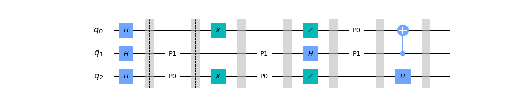

# Quantum Hold'em

## Introduction
- The game can be run from main.py
- Quantum Hold'em is a two-player game designed to develop an intuition about common operations on qubits.
- In the beginning, every player gets a set of cards with gates. In the simple version of the game, they are drawn from the set (_X_, _H_, _Z_, _HZ_, _I_).
- A quantum circuit with randomly distributed gates and several empty fields is generated. The gates are splitted into several layers separated by barriers. In each round of the game, players fill the empty fields (starting from the left) by placing their cards on the spots denoted by _P0_ and _P1_ for the player number 0 and 1, respectively.

- When the last empty layer is filled, the game finishes and the final state is calculated.
- Player 0 wins if 0's are represented in the final state with probability higher than 50%, and vice versa for player 1.
- There are three modes, one where everything is shown (normal), one where all the gate positions are shown, but the gates
  are hidden (hidden) and a Hold'em style mode where the board is hidden and unveiled as the game is played (Poker)
  ## Requirements
  -Pillow (PIL)
  -Qiskit
  -pysimpleGUI
  -numpy
  -matplotlib
  
